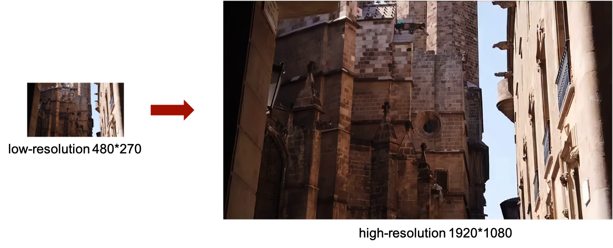
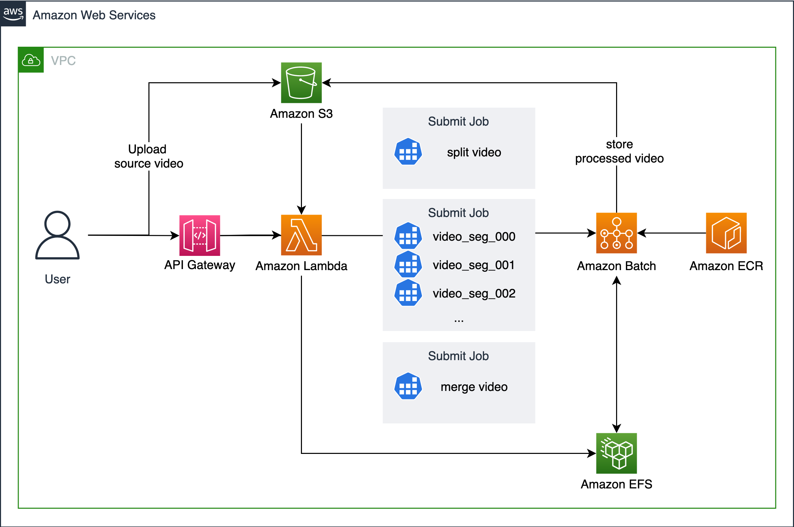

# AI Video Super-Resolution

Upscale video resolution quality with advanced AI algorithms

The process of reconstructing high-resolution video from low-resolution video is called super-resolution reconstruction. Recent state-of-the-art super-resolution methods have achieved impressive performance on ideal datasets. However, these methods always fail in real-world video super-resolution, since most of them ignore the blurring and noise that exists in the real world (such as video compression). Together with scientists from the GluonCV team, we developed a deep learning based super-resolution approach named GDAVSR. This approach can bring better visual quality. Based on this method, we can help customers improve the resolution of videos at a low cost.



## Architecture diagram


## Usage

## CloudFormation(Recommend)

Login to the AWS console and select the link below to launch the AWS cloudformation template.

- [Global](https://console.aws.amazon.com/cloudformation/home?region=us-west-2#/stacks/new?stackName=SuperResolution&templateURL=https://aws-gcr-solutions.s3.amazonaws.com/Aws-gcr-ai-super-resolution/latest/SuperResolutionStack.template)
- [China](https://console.amazonaws.cn/cloudformation/home?region=cn-north-1#/stacks/new?stackName=SuperResolution&templateURL=https://aws-gcr-solutions.s3.cn-north-1.amazonaws.com.cn/Aws-gcr-ai-super-resolution/latest/SuperResolutionStack.template)

### CDK
- An AWS account
- Python installed, such as 3.6
- Install dependencies of app  
- Build lambda layer 

```
pip install -r requirements.txt
cd layers
chmod +x build_layer.sh
./build_layer.sh
cd ..
```

```
cdk synth -c inferentia=true
cdk deploy --parameters MaxvCpus=<max cpu>
```
MaxvCpus:default: 16


### How to use
1. Upload low-resolution video to S3 bucket('superresolutions*')
1. call Lambda func SuperResolutionSplitVideo
```
{
"key": "video_file",
"scale": "4",
"task": "inference"
}
```
    - key: filename in s3 bucket
    - scale['2', '4']: Scale for super resolution. Default: 2
    - task[inference, debug]: When it is set to debug, the intermediate file will be uploaded to S3 for debugging. Default: inference
    - env[onDemand, spot]: which the type of machine to be used. Default: spot

1. Wait for Batch processing..
1. Download high-resolution video from S3 bucket('superresolutions*')

