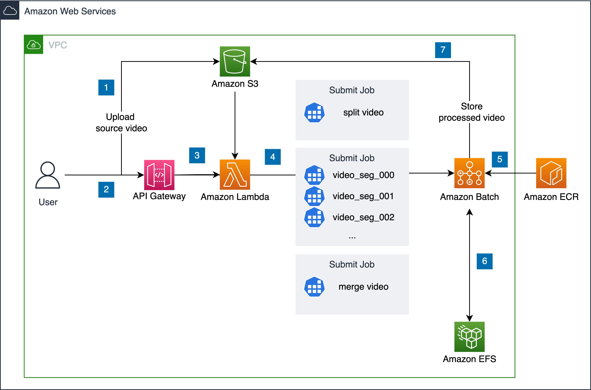

Deploying this solution with the default parameters builds the following environment in the AWS cloud.

*Figure 1: Solution architecture*

This solution deploys the AWS CloudFormation template in your AWS cloud account and completes the following settings.

1. Upload the original video file to the [Amazon S3][s3] bucket which will be created upon the deployment of the solution.
2. Use [Amazon API Gateway][api-gateway] to implement HTTP API for interaction with deployed services.
3. The [AWS Lambda][lambda] function receives requests.
4. The [AWS Lambda][lambda] function starts the calculation job of [AWS Batch][Batch].
5. [AWS Batch][Batch] is used to pull pre-built model images from ECR, schedules the super resolution jobs (including video slicing, processing and merging operations) on pre-defined computing resources with scaling, and automatically releases the backend computing resources after all jobs are done.
    - Video slicing: download the original video from the S3 bucket and split it into several slices.
    - Super resolution processing: run a job for each slice, and perform super resolution on each slice of the video based on the pre-trained model.
    - Merging: merge the super resolution results, and then the merged result file is uploaded to the Amazon S3 bucket.
6. [Amazon EFS][efs] is used for temporary storage of intermediate files during video processing.
7. [Amazon S3][s3] is used to store original video assets and processed video assets.

[Amazon VPC][vpc] is created using subnets in two Availability Zones (AZ) to achieve redundancy and ensure high availability. All resources will be deployed in both availability zones.

[vpc]: https://aws.amazon.com/cn/vpc/?nc1=h_ls
[api-gateway]: https://aws.amazon.com/api-gateway/?nc1=h_ls
[lambda]: https://aws.amazon.com/lambda/?nc1=h_ls
[Batch]: https://aws.amazon.com/batch/?nc1=h_ls
[s3]: https://aws.amazon.com/s3/?nc1=h_ls
[efs]: https://aws.amazon.com/efs/?nc1=h_ls
