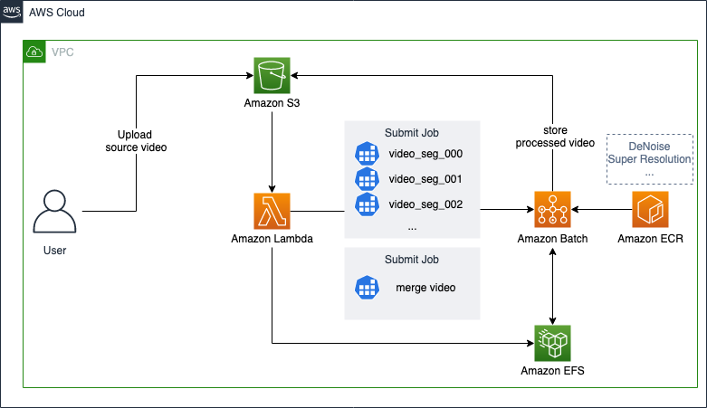

使用默认参数部署此解决方案会在亚马逊云科技中构建以下环境。

      
图：部署的架构

此解决方案在您的亚马逊云科技账户中部署一个Amazon CloudFormation模板并设置以下内容：

- CloudFormation 模板创建了：
    - 使用 [Amazon API Gateway][api-gateway] 实现的用户访问接口。
    - [Amazon Lambda][lambda] 函数用来接收用户请求，并启动[Amazon Batch][Batch]的计算Job。
    - [Amazon S3][s3] 用来进行视频持久化存储。
    - [Amazon EFS][efs] 用来进行处理时中间文件的临时存储。
    - [Amazon Batch][Batch] 从ECR拉取预构建的模型镜像，并通过ECS启动[Amazon EC2 Inf1][inf1]实例运行计算Job，进行视频切片、分片处理、合并操作。

为了实现冗余，[Amazon VPC][vpc] 使用两个可用区 (AZ) 中的子网创建，以实现高可用性。 所有资源部署在这两个可用区中。

[vpc]: https://aws.amazon.com/cn/vpc/
[lambda]: https://aws.amazon.com/cn/lambda/
[s3]: https://aws.amazon.com/cn/s3/
[api-gateway]: https://aws.amazon.com/cn/api-gateway/
[Batch]: https://aws.amazon.com/cn/batch/
[efs]: https://aws.amazon.com/cn/efs/
[inf1]: https://aws.amazon.com/cn/ec2/instance-types/inf1/