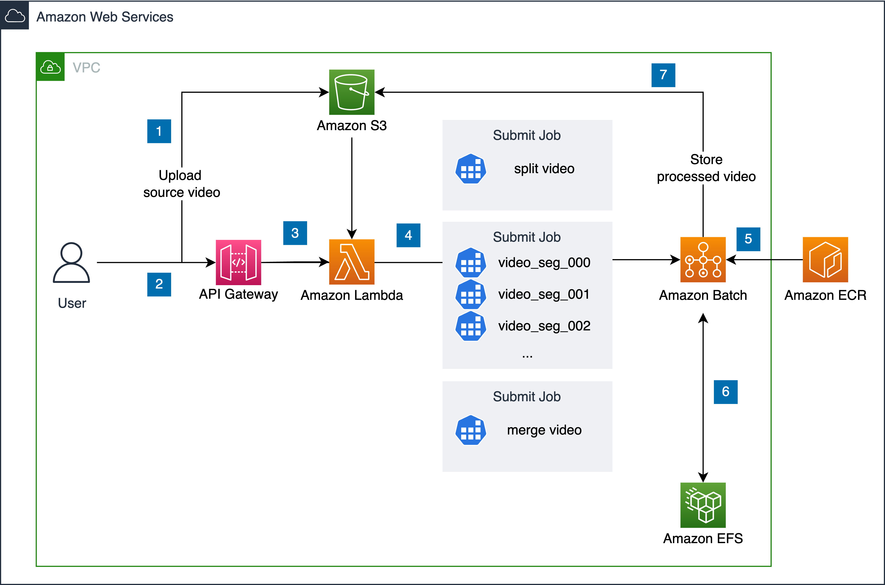

使用默认参数部署本解决方案会在亚马逊云科技中构建以下环境。

      
图：方案架构

本解决方案在您的亚马逊云科技账户中部署AWS CloudFormation模板并完成以下设置。

1. 将原始视频文件上传到在部署解决方案时创建的[Amazon S3][s3]桶。
2. 使用[Amazon API Gateway][api-gateway]实现HTTP API，从而和部署的服务进行交互。
3. [Amazon Lambda][lambda]函数接收请求。
4. [Amazon Lambda][lambda]启动[Amazon Batch][Batch]的计算作业。
5. [Amazon Batch][Batch]用于从ECR中拉取预构建的模型镜像，调度预定义的计算资源运行超分辨率作业（包括视频切片、处理和合并操作），同时根据情况调整资源，并在所有工作完成后自动释放后端的计算资源。
	- 视频切片：从Amazon S3存储桶中下载原始视频并将其拆分为多个切片。
	- 视频处理：对每个切片运行一个作业，并根据预训练的模型对视频的每个切片应用预训练的超分辨率模型。
	- 视频合并：合并视频处理结果，然后将合并后的结果文件上传到Amazon S3存储桶。
6. [Amazon EFS][efs]用于视频处理时中间文件的临时存储。
7. [Amazon S3][s3]用于存储原始视频资产和处理后的视频资产。

[Amazon VPC][vpc]使用两个可用区 (AZ) 中的子网创建，从而实现冗余，保证高可用性。所有资源均部署在这两个可用区中。

[vpc]: https://aws.amazon.com/cn/vpc/
[api-gateway]: https://aws.amazon.com/cn/api-gateway/
[lambda]: https://aws.amazon.com/cn/lambda/
[s3]: https://aws.amazon.com/cn/s3/
[Batch]: https://aws.amazon.com/cn/batch/
[efs]: https://aws.amazon.com/cn/efs/
[inf1]: https://aws.amazon.com/cn/ec2/instance-types/inf1/